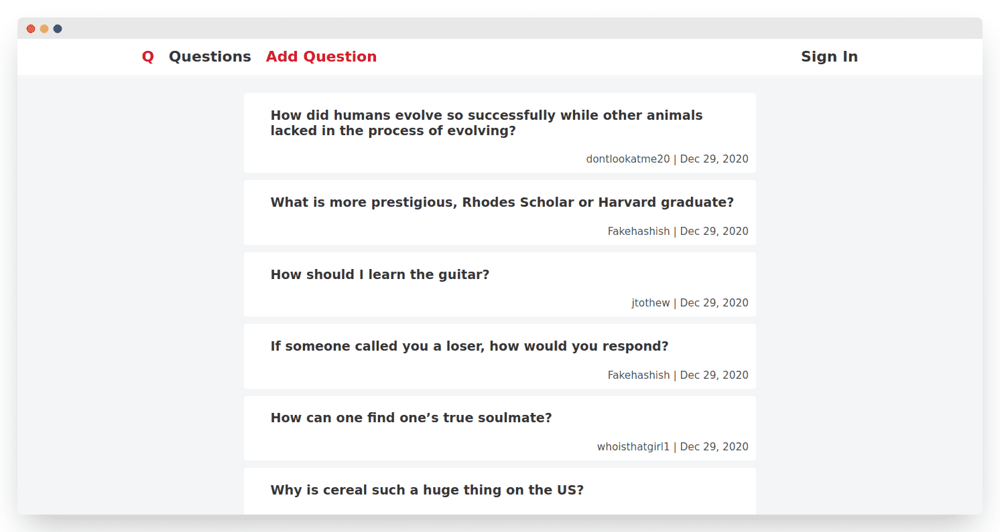
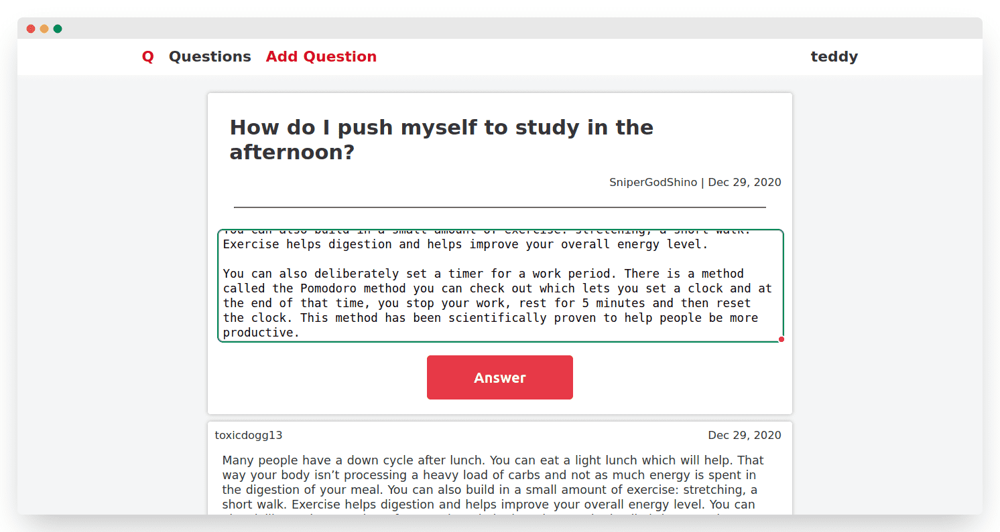
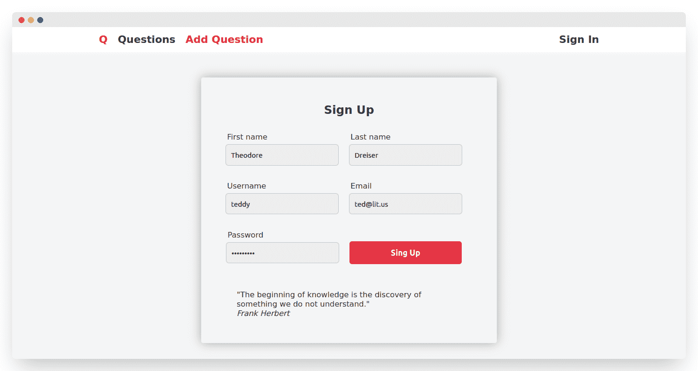
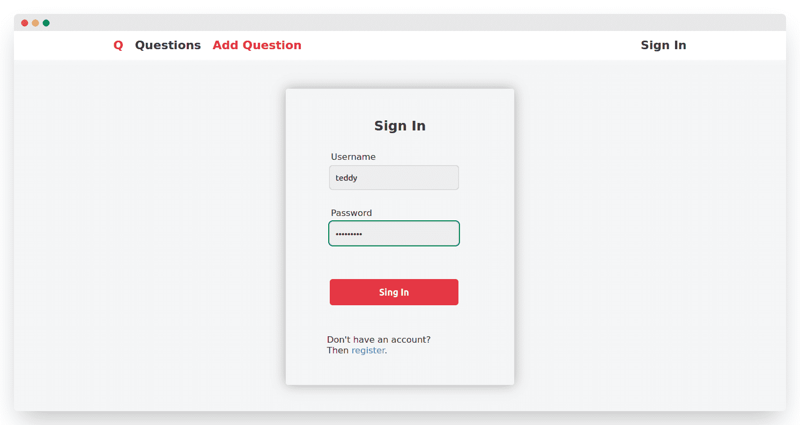

# Ask

This is a **question-and-answer website** where questions are asked and answered by users. 

The project was created for educational purposes. The project took its start in a course [Web Technologies](https://stepik.org/course/154) made by Mail.ru Group.



<br>

# Features

- Question/answer [create, delete]
- Registration
- Ajax pagination

<br>

# Installation

1. Clone or download the repository.

2. Create [virtual environment and install requirements](https://packaging.python.org/en/latest/guides/installing-using-pip-and-virtual-environments/) from `requirements.txt`.

3. Make migrations and migrate.

   `python manage.py makemigrations`

   `python manage.py migrate` 

4. Go to `data/` folder and run `load_data.sh` script.

   The script feeds initial data from `data/` to sqlite database.

5. Run Django server with command `python manage.py runserver`.

   Now you can open the site by link `http://127.0.0.1:8000/`.

<br>


# Directories and files

```
.
├── ask/			# Django project
│   ├── ask/			# Configuration package	
│   └── qa/ 		   # Django application
├── data/			# Initial data for database
├── .env            # Environment variables
└── ...
```
<br>

# Screenshots





