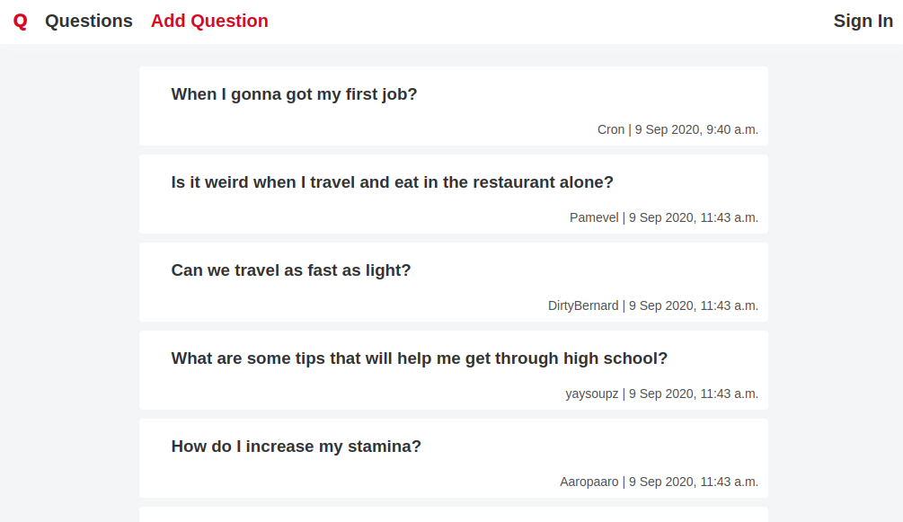

# Ask

This is a question-and-answer website where questions are asked and answered by users .



# Requirements 

You should have a Linux system (Ubuntu 20.04) with the following packages installed:

- [Python 3.5+](https://docs.python-guide.org/starting/install3/linux/)
- [nginx 1.18.0](https://docs.nginx.com/nginx/admin-guide/installing-nginx/installing-nginx-open-source/#prebuilt_ubuntu)
- [mysql-server 8.0.21](https://support.rackspace.com/how-to/install-mysql-server-on-the-ubuntu-operating-system/)
- [Git](https://git-scm.com/download/linux)

# Installation

1. Clone the repository preferably in 'home' directory:

   ```
   git clone https://github.com/pavel-loginov-dev/website-ask.git
   ```

2. Open the file `website-ask/.env_sample` and fill environment variable.

   [^SECRET_KEY]:  write an arbitrary character set (don't use '$' symbol)
   [^DATABASE_PASSWORD]: If you don't have a mysql user, then choose any password

   After filling the file, rename it on `.env` 

3. Unlink default nginx server config file:

   ```
   unlink /etc/nginx/sites-available/default
   ```

4. Follow to the folder  `website-ask/bin/`  that contains scripts and execute scripts with command:

   ```
   ./script_name.py
   ```

   Read the file `README.md` in `website-ask/bin/` folder before execution.

4. The website should be available by the link http://127.0.0.1:8000. But there is no content. To fill database with content make step 5.

5. Follow to the folder  `website-ask/bin/data/`  and execute the script:

   ```
   ./load_data_db.py
   ```

   

### About

The project was created for educational purposes. The project took its start in the course of [Web Technologies](https://stepik.org/course/154) from Mail.ru Group.